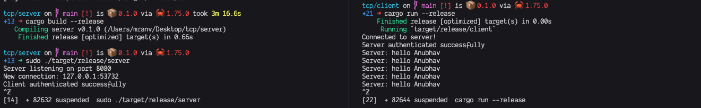

# TCP Client-Server Communication in Rust

This project demonstrates a basic implementation of client-server communication using TCP sockets in Rust. The server and client components are written in Rust programming language.

## Features

- Secure authentication using a shared secret token.
- Continuous communication between the server and client.
- Error handling for network connections and data transmission.



## Getting Started

To get started with the project, follow these steps:

1. Clone the repository:

   ```bash
   git clone https://github.com/mranv/tcp.git
   ```

2. Navigate to the project directory:

   ```bash
   cd tcp
   ```

3. Compile the code:

   ```bash
   cargo build --release
   ```

4. Run the server:

   ```bash
   ./target/release/server
   ```

5. Run the client:

   ```bash
   ./target/release/client
   ```

## Usage

Upon running the client, it connects to the server and attempts to authenticate using a shared secret token. If authentication is successful, the server sends continuous "hello" messages to the client, which are displayed on the client's terminal. If authentication fails, the server refuses the connection.

## License

This project is licensed under the Apache License 2.0. See the [LICENSE](LICENSE) file for details.

## Contributing

Contributions are welcome! Feel free to submit pull requests or open issues for any improvements or suggestions.

## Acknowledgments

Special thanks to [OpenAI](https://openai.com) for providing assistance with language models.

## Support

For any questions or support, please [open an issue](https://github.com/mranv/tcp/issues) on GitHub.

## Repository

Visit the [GitHub repository](https://github.com/mranv/tcp) to explore the code and contribute to the project.
